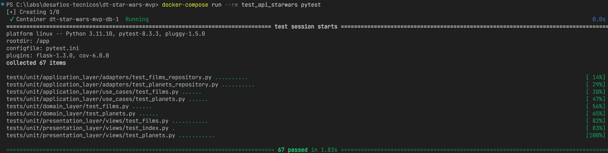
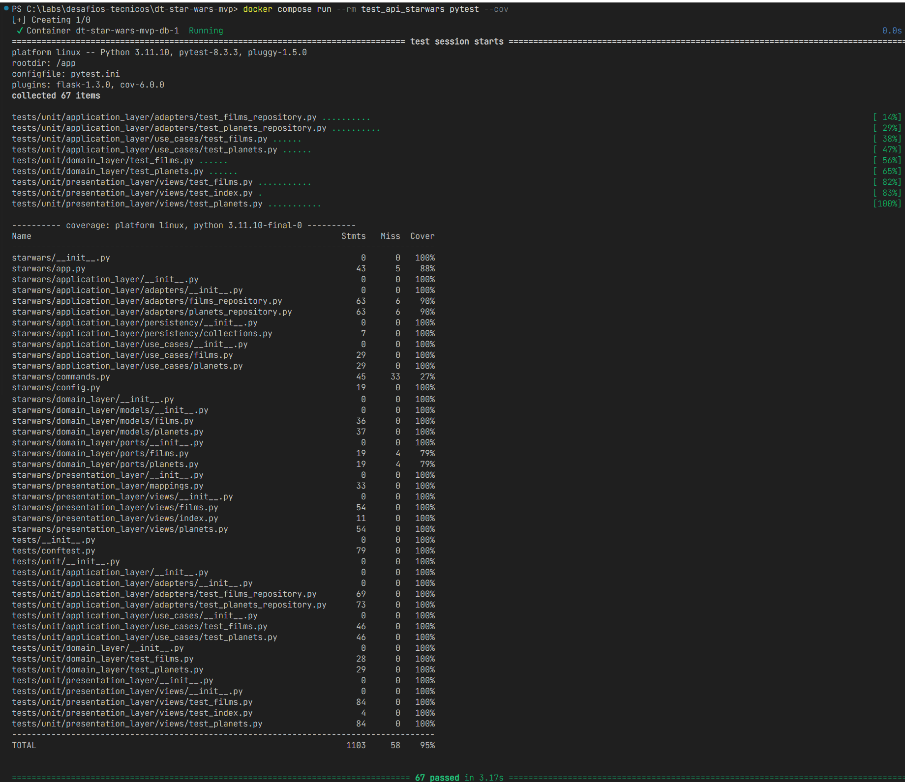

# api-starwars

API REST (Crud) baseada no projeto https://swapi.dev/ com dois recursos: **Planets** e **Films** (MVP):

* O recurso **Planets** contém informações como: **id**, **name**, **climate**, **diameter**, **population** e **films**, além da data em que foi inserido (**created**) e a data da última alteração (**edited**).

* O recurso **Films** contém informações como: **id**, **release_date**, **director** e **planets**, além da data em que foi inserido (**created**) e a data da última alteração (**edited**).

# Resources

## Films

Um recurso **Film** é um único filme.

### Endpoints

* `POST /api/films` -- Cadastra um novo filme
* `GET /api/films/{id}` -- Retorna um filme específico de acordo com o id passado
* `PUT /api/film/{id}` -- Atualiza um filme específico
* `DELETE /api/films/{id}` - Remove um filme específico de acordo com o id passado

## Planets

Um recurso **Planet** é uma grande massa, planeta ou planetoide no Universo Star Wars, no momento 0 ABY.

### Endpoints

* `POST /api/planets` -- Cadastra um novo planeta
* `GET /api/planets/{id}` -- Retorna um planeta específico de acordo com o id passado
* `PUT /api/planets/{id}` -- Atualiza um planeta específico
* `DELETE /api/planets/{id}` -- Remove um planeta específico de acordo com o id passado

# Executando o Projeto com Docker

Clone o repositório
* `git clone git@github.com:alessandroibes/api_starwars.git`

Para iniciar, basta executar o comando:

```bash
docker-compose up -d
```

A Api estará disponível em: `http://localhost:5000`

## Testes

Executando os testes por dentro do docker:

```bash
docker-compose run --rm test_api_starwars pytest
```



Para verificar a cobertura do projeto:

```bash
docker-compose run --rm test_api_starwars pytest --cov
```



# Executando o projeto localmente

* Clone o repositório
    * `git clone git@github.com:alessandroibes/api_starwars.git`

* Crie um ambiente virtual

* Instale as dependências do projeto
    * `pip install -r src/dependencies/requirements-dev.txt`

* Defina as variáveis de ambiente (crie um arquivo `.env` dentro da pasta /src) -- ver arquivo `.env.sample`
    * DEPLOY_ENV
    * LOG_LEVELS
    * MONGO_URI

* Inicie a aplicação (executar de dentro da pasta /src)
    * `flask run`

* Verifique a saúde da aplicação
    * `GET /health-status` -- Se a aplicação estiver rodando você verá:
    ```json
    {
        "service": "API Star Wars HealthCheck",
        "version": "1.0"
    }
    ```

## Comandos

Criar collections do Mongo (executar de dentro da pasta /src)

```bash
flask configure_collections
```

Remover collections (executar de dentro da pasta /src)

```bash
flask drop_collections
```

# Documentação

A documentação, pode ser acessada através dos endpoints `/api/films/docs/swagger` e `/api/planets/docs/swagger`:

* http://localhost:5000/api/films/docs/swagger
* http://localhost:5000/api/planets/docs/swagger